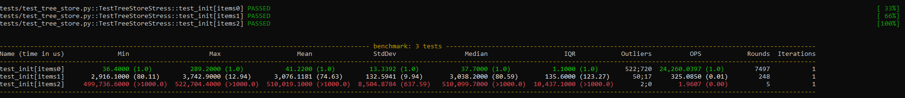
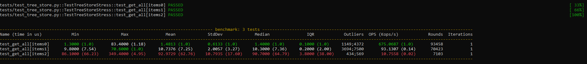
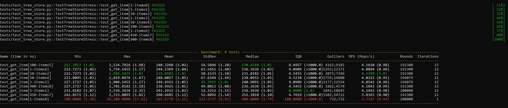
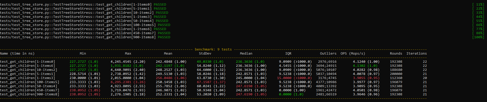
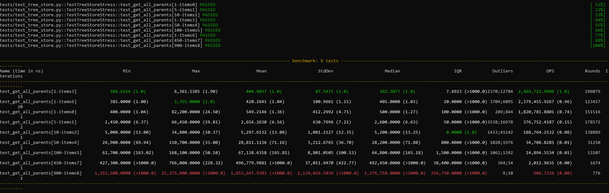

# Тестовое задание для MStroy (ООО Статус)
Есть массив объектов, которые имеют поля id и parent, через которые их можно связать в дерево и некоторые произвольные поля.

Нужно написать класс, который принимает в конструктор массив этих объектов и реализует 4 метода:
* `getAll()` Должен возвращать изначальный массив элементов.
* `getItem(id)` Принимает id элемента и возвращает сам объект элемента;
* `getChildren(id)` Принимает id элемента и возвращает массив элементов, являющихся дочерними для того элемента, чей id получен в аргументе. Если у элемента нет дочерних, то должен возвращаться пустой массив;
* `getAllParents(id)` Принимает id элемента и возвращает массив из цепочки родительских элементов, начиная от самого элемента, чей id был передан в аргументе и до корневого элемента, т.е. должен получиться путь элемента наверх дерева через цепочку родителей к корню дерева. Порядок элементов важен!

**Требования:** максимальное быстродействие, следовательно, минимальное количество обходов массива при операциях, в идеале, прямой доступ к элементам без поиска их в массиве.

## Исходные данные:
```python
class TreeStore:
    pass


items = [
    {"id": 1, "parent": "root"},
    {"id": 2, "parent": 1, "type": "test"},
    {"id": 3, "parent": 1, "type": "test"},
    {"id": 4, "parent": 2, "type": "test"},
    {"id": 5, "parent": 2, "type": "test"},
    {"id": 6, "parent": 2, "type": "test"},
    {"id": 7, "parent": 4, "type": None},
    {"id": 8, "parent": 4, "type": None}
]
ts = TreeStore(items)
```

## Примеры использования:
```python
ts.getAll()
>>> [{"id":1,"parent":"root"},{"id":2,"parent":1,"type":"test"},{"id":3,"parent":1,"type":"test"},{"id":4,"parent":2,"type":"test"},{"id":5,"parent":2,"type":"test"},{"id":6,"parent":2,"type":"test"},{"id":7,"parent":4,"type":None},{"id":8,"parent":4,"type":None}]
```

```python
ts.getItem(7)
>>> {"id":7,"parent":4,"type":None}
```

```python
ts.getChildren(4)
>>> [{"id":7,"parent":4,"type":None},{"id":8,"parent":4,"type":None}]
```

```python
ts.getChildren(5)
>>> []
```

```python
ts.getAllParents(7)
>>> [{"id":4,"parent":2,"type":"test"},{"id":2,"parent":1,"type":"test"},{"id":1,"parent":"root"}]
```

## Системные требования
* Python >= 3.9

## Реализация
[tree_store](tree_store).

Не реализовано:
* добавление элемента в дерево

* удаление элемента из дерева

* запрет на изменение `id` элемента или отслеживание этого изменения. Элементы в дереве представлены словарями. Можно получить элемент (`get_item`) и изменить его `id`. Дерево никак на это не отреагирует.
```python
from tree_store import TreeStore
ts = TreeStore([{"id": 1, "parent": "root"}, {"id": 2, "parent": 1}, {"id": 3, "parent": 2}])

item = ts.get_item(2)
item["id"] = 4

# id изменен на 4
ts.get_all()
>>> [{'id': 1, 'parent': 'root'}, {'id': 4, 'parent': 1}, {'id': 3, 'parent': 2}]

# но дерево не может найти элемент с id == 4
ts.get_item(4)
>>> tree_store.exceptions.ItemNotFoundError: item with id 4 does not exists
```

* запрет на изменение `parent` элемента или отслеживание этого изменения. Элементы в дереве представлены словарями. Можно получить элемент (`get_item`) и изменить его `parent`. Дерево никак на это не отреагирует.
```python
from tree_store import TreeStore
ts = TreeStore([{"id": 1, "parent": "root"}, {"id": 2, "parent": 1}, {"id": 3, "parent": 2}])

item = ts.get_item(2)
item["parent"] = "root"

# parent изменен на root. Теперь в дереве два корневых элемента, хотя должны были бы получить ошибку при изменении на root
ts.get_all()
>>> [{'id': 1, 'parent': 'root'}, {'id': 2, 'parent': 'root'}, {'id': 3, 'parent': 2}]

# смогли создать цикл в дереве
item["parent"] = 3
ts.get_all_parents(2)
>>> RecursionError: maximum recursion depth exceeded in comparison
```

* можно было бы добавить возможность работать с объектами имеющими атрибуты `id` и `parent`:
```python
from dataclasses import dataclass
from tree_store import TreeStore


@dataclass
class Test:
    id: int
    parent: int
    type: str

    
ts = TreeStore([
    Test(id=1, parent="root", type="test1"),
    Test(id=2, parent=1, type="test2"),
])

ts.get_item(2)
>>> Test(id=2, parent=1, type='test2')
```

## Установка
```shell
git clone https://github.com/vowatchka/mstroy_test_task
cd mstroy_test_task
python -m venv venv
source venv/bin/activate
python -m pip install -r requirements.txt
```

## Тестирование
Список доступных маркеров тестов:
```shell
pytest --markers
```

Запуск тестов на примерах из задания:
```shell
python -m pytest -m from_task -v
```

Запуск тестов без тестов производительности:
```shell
python -m pytest -m without_benchmark -v
```

Запуск тестов производительности:
```shell
python -m pytest -m with_benchmark -v
```

## Оценка производительности
При инициализации дерева роизводительность убывает в зависимости от объема и глубины дерева:
```shell
python -m pytest -m benchmark_init -v
```


При обращении к элементам дерева производительность высокая, за счет того, что сокращено количество обходов элементов:
```shell
python -m pytest -m benchmark_get_all -v
```


```shell
python -m pytest -m benchmark_get_item -v
```


```shell
python -m pytest -m benchmark_get_children -v
```


Производительность может снижаться при получении всех родительских элементов, за счет того, что нужно перебирать всех родителей:
```shell
python -m pytest -m benchmark_get_all_parents -v
```

